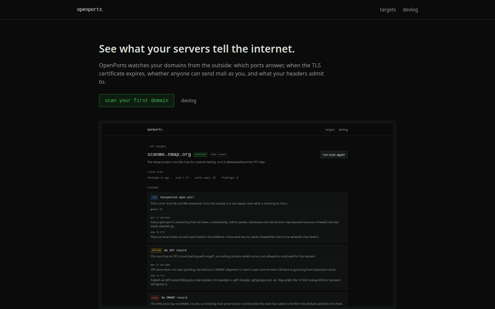
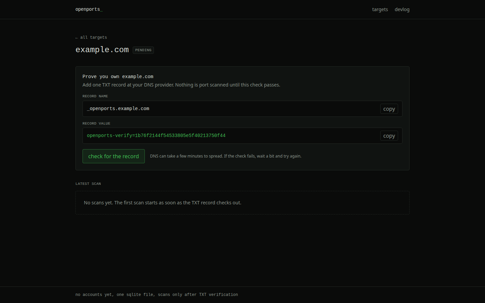
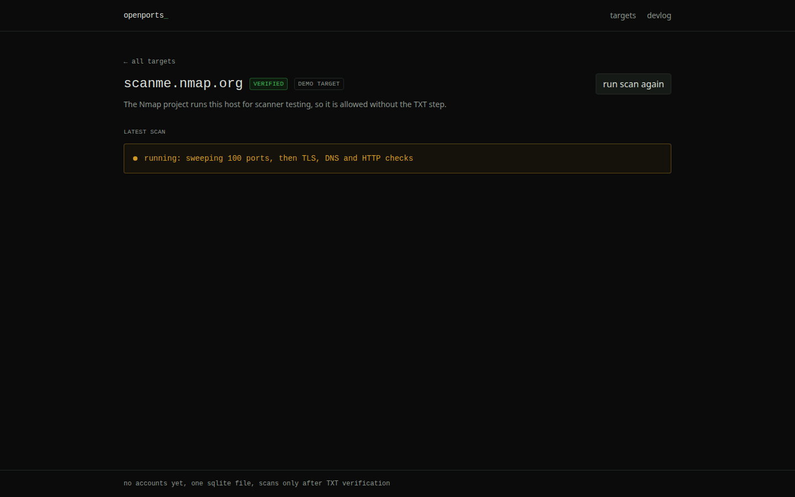
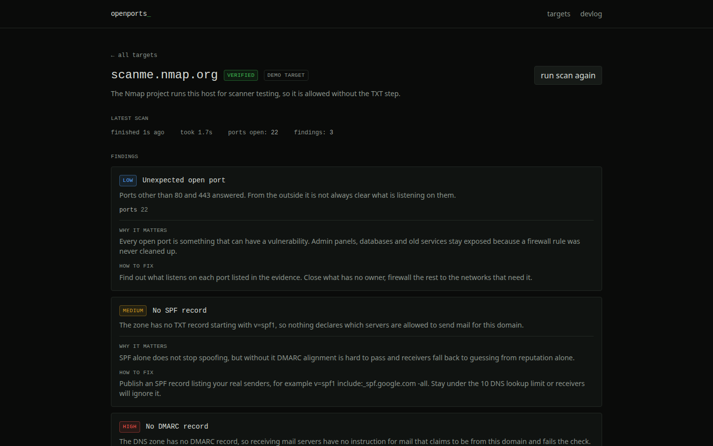

# 001: the first loop works

2026-09-18

OpenPorts watches a domain from the outside and reports what it exposes: open ports, TLS certificates on their way out, mail records that let anyone spoof you, headers that give away the stack. Today the first full loop went end to end: add a domain, publish one TXT record to prove you own it, and the scanner runs. No record, no scan. The single exception is scanme.nmap.org, which the Nmap project runs specifically so scanner authors can point at something.

The scanner is deliberately modest. One TCP connect sweep over the 100 ports most likely to be open, 64 connections at a time with a 1.5 second timeout per port, a TLS handshake on 443 to read the certificate, DNS lookups for SPF, DMARC and MX, and three HTTP checks: HSTS, the http to https redirect, and the Server banner. Nothing sends a payload, nothing probes services. A full scan of scanme.nmap.org takes 1.7 to 2.4 seconds. Findings come from one shared catalog module, each with a severity and a fix written in full sentences.

Two bugs today worth writing down.

The port list was wrong. I assembled the top 100 list by hand and wrote a test asserting it contains 21, 22, 23, 80, 443 and 3389. The test failed: no 3389. That means the RDP finding, the one high severity port finding in the whole catalog, could never fire. A test that checks a data file felt like ceremony right up until it caught exactly this. Port 90 got dropped (never seen it open), 3389 went in.

Scanme's port 80 is haunted. In one run the sweep sees it open and the report comes back with 4 findings. Minutes later the SYN connects but the HTTP GET over the same port blackholes until timeout, and the report drops to 3 findings. For a monitoring product that is the worst possible behavior: the finding flips while the customer did nothing. The raw scan output now records refused versus filtered per port so I can see what the network actually said, and the redirect finding carries the http error next to it instead of pretending the check came back clean. The real fix, confirming a state change twice before calling it a change, goes on the alerts list.

Choices, and why: SQLite through Drizzle instead of Postgres, because a second service to babysit is a second reason not to ship. The scan worker is a plain interval in the server process with a global guard, the least infrastructure I could get away with, and it survives hot reloads without double scanning. Verification is one TXT record at _openports.<domain>: cheap for the owner, undeniable for me, and the worker rechecks the target status before it touches the network, so there is no bypass path in the code.

What currently sucks: no service identification, so "ports 9929 and 31337 open" (both genuinely open on scanme) tells you nothing about what is listening. The TLS check only runs when 443 answers, so mail TLS on 465 and 993 stays invisible. One worker means one scan at a time, fine at one target, embarrassing at fifty. And my own banned-character grep keeps finding an em dash inside a markdown file that next dev regenerates on every boot, so that file lives in .gitignore now. The grep wins.

Next: banner grabbing on open ports so a finding says "OpenSSH on 22" instead of a bare number, scheduled rescans, and a diff between scans, because "port 3389 appeared since yesterday" is the actual product. The rest is decoration.
