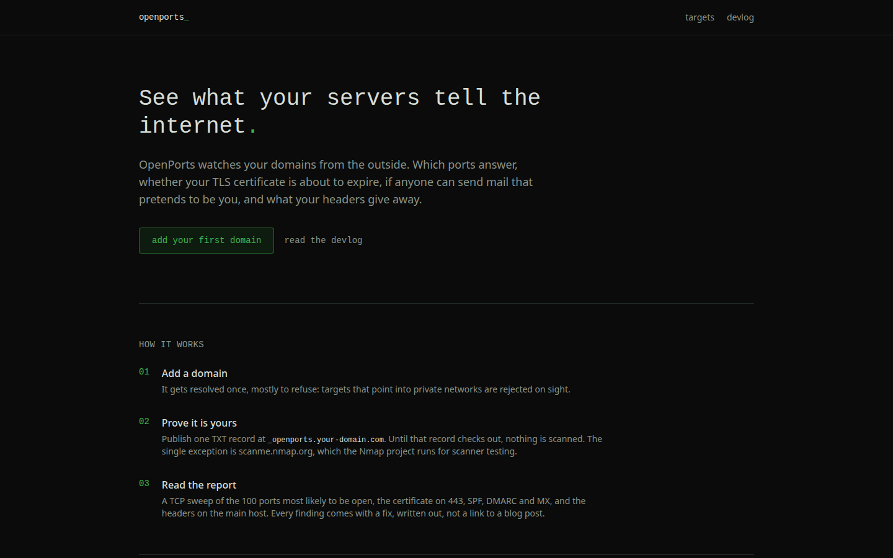
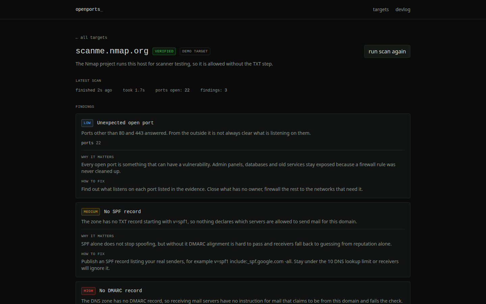
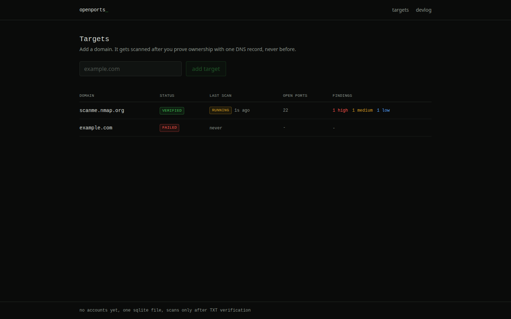
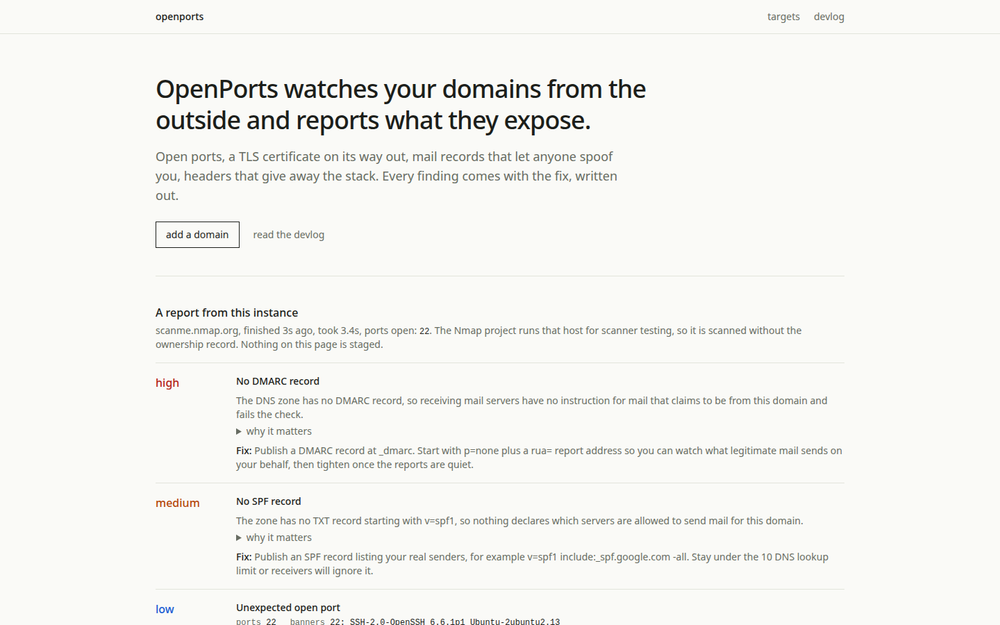
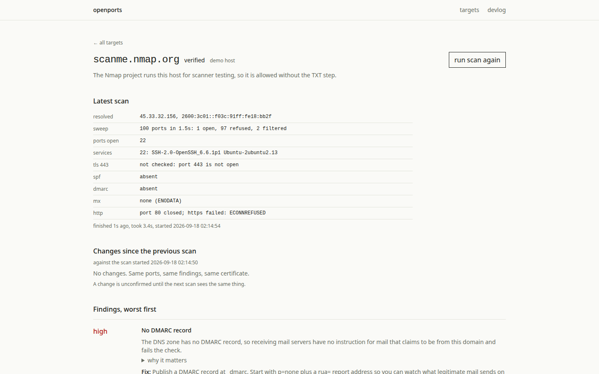

# 002: the ui rework

2026-09-18

The scanner works and the loop is honest, but the frontend reads like it came off an assembly line. Before touching a single component I screenshotted every page and every state at 1440x900, production build, real data, and judged each shot as a stranger who owes this project nothing: would a security engineer believe one skeptical person built this, or does it pattern-match a template? Here is the full list of tells, with the shots that gave them away.

The tells, worst first:

1. The landing opens with a monospace display headline and a green period. The logo is `openports_` with a green underscore. This is terminal cosplay. Monospace at display size is a costume, and the blinking-cursor underscore is the first thing every generated dark dashboard reaches for.
2. The landing has a numbered 01 02 03 "how it works" list with green numbers. No tool a security engineer respects explains itself in numbered pastel steps. That pattern belongs to marketing sites for products that have nothing better to show.
3. Which is exactly what the landing does: four full sections describing the product before one pixel of product output. "Every finding comes with a fix, written out, not a link to a blog post" is a claim sitting next to zero findings. The page had evidence available and chose prose.
4. Rows of pill badges where a word would do. VERIFIED, FAILED, RUNNING, DONE, PENDING, LOW, MEDIUM, HIGH: tinted rounded pills everywhere, so the eye gets four colors doing five different jobs. On the history table three identical DONE pills stack in a column and say the same thing three times.
5. Every state is a rounded tinted box. Queued is a yellow box, running is a yellow box, failed is a red box, the empty states are dashed boxes with centered text. Boxes-with-borders-around-one-sentence is the signature move of the generic dark dashboard.
6. The findings list is three identical cards stacked: severity pill, title in mono, a meaning sentence that mostly restates the title, then WHY IT MATTERS and HOW TO FIX as uppercase micro-labels. Cards plus micro-labels plus pills is the triple tell.
7. The page rhythm is evenly airy: every section the same max width, the same vertical padding, the same generous margins. Nothing is dense, so nothing matters. A real report has peaks; this page is upholstered.
8. Color is decorative. The verify token is green (it is not good or bad, it is a token), the headline period is green, buttons are green-tinted ghosts. If color is spent on decoration, it cannot carry severity.

The second pass over the shots found tells the first list missed:

9. Findings render worst-last. The scanme report in the shots shows LOW, then MEDIUM, then HIGH. The evaluator sorts worst first, the query reverses it. A security engineer reads top down; the most important finding was at the bottom of the page. A real bug, caught by judging the screenshot instead of the code.
10. Red on a normal condition. The failed verification line prints in alarm red, but "no TXT record yet" is the expected state of every fresh target. Reserve red for things that are actually wrong.
11. "1s ago" next to a RUNNING badge: the dashboard shows the age of a scan that has not finished. It should say when it started.
12. Uppercase letter-spaced micro-labels everywhere: DOMAIN, RECORD NAME, WHY IT MATTERS. Labels shouting single words at me is chrome, not information.
13. History timestamps like "18 Sept 2026, 01:40" take a third of the table width to say less than `2026-09-18 01:40:12` would.

The verdict: every single shot patterns as a template. Not one of them could have been produced by someone with one point of view, because the point of view on display is "dark SaaS dashboard, default settings". The scan output, which is the only thing this product actually has, is buried under chrome whose only job is to look finished.

## the stance

Dense network tool. Scan output is the interface. Rules, written down so I cannot sneak back:

- Paper, not night mode. Off-white background, near-black ink, hairline rules. The reference points are man pages, RFCs and nmap's own site, not a dashboard.
- No rounded corners, no tinted boxes, no shadows, no gradients, no glow. A sentence does not get a box.
- Tables are the interface. The scan result renders as a table, findings render as a report list, everything else is a sentence.
- Monospace belongs to data only: ports, IPs, tokens, timestamps, JSON, record names. Headings and body text are sans.
- Color appears exactly once in the system: severity. High, medium, low, info. Red is also allowed to mark a real failure. Nothing else on any page gets color. There is no accent green anywhere.
- Statuses are lowercase words, not pills. Empty states are sentences, not dashed boxes.
- The landing shows a real report from this instance's database. No report, one honest sentence saying so.

## what the rework built

The landing now leads with a real report: the latest finished scan from this instance's own database, rendered with the same component the target page uses. The Nmap project runs that host for scanner testing, so it is scanned without the ownership record, and the page says so. Below it: how a scan gets allowed, with the actual TXT record shape, what a scan reads as a plain table, and the limits. The claims are gone; the numbers are live. On a fresh install with no scan yet it says exactly that and names the command to change it.

The target page became what the product actually produces: the full scan result as a table. Resolved addresses, the sweep with its refused and filtered counts, open ports, a services row, the certificate check, SPF, DMARC, MX, and the HTTP row. States are single lines, not boxes: queued, running, failed each get one sentence in the status color and nothing else. Findings render as a report list, severity in a fixed column, evidence in monospace, the fix always visible, the rationale behind a click. Worst first, which the old page got backwards.

The dashboard lost its pills and its dashed placeholder box. The verify instructions lost their card. Buttons are outlined ink and invert on hover. The green accent is gone from the codebase entirely.

## the second critique

I re-shot all eleven states against the new build and judged them again, and the second pass caught me on three things.

The first landing shot showed the empty fallback, because the script photographed the landing before any scan existed. The devlog shot has to show the report, so the script now captures the landing last, after its scans have run.

The HTTP row printed "port 80 answers undefined, no redirect". That is the scanme port 80 haunting from devlog 001 leaking into a label: the sweep saw the port open, the GET never came back, and the row had nothing honest to print. It now says what happened: port 80 open, http request failed, or timed out.

The staged failed scan (a fixture row, disclosed in the script, because a real scan failure cannot be scheduled on demand) carried a timestamp older than the scans above it, so the history read out of order. The fixture is now stamped seconds ago.

After the fixes I re-shot everything a third time and had a stranger read the final set with the before set as context. All twelve pages passed: the stance holds on every page, the data is consistent across dashboard, history, findings and raw output, and nothing patterns as a template. Three shots from the after set tell the story on their own.

## banners, so a port says what it is

Devlog 001 ended on "ports 9929 and 31337 open tells you nothing about what is listening". Now every open port gets one short conversation after the sweep: listen for a greeting, since ssh, ftp and smtp speak first; if nothing arrives, one plain http GET; on the TLS ports, read the certificate subject with validation left on. A port that says nothing is recorded as "no banner", which is a real result. The scanme report now reads "22: SSH-2.0-OpenSSH_6.6.1p1 Ubuntu-2ubuntu2.13", straight off the wire, and the open port findings carry the banner in their evidence.

One design fight worth recording: the first version disabled certificate validation to read self-signed certs on 465, 993 and 995. The repo's security checks refused to accept it. The argument for validation won: a self-signed certificate is exactly the thing a monitoring tool should report, so "certificate rejected: self signed certificate" is a better answer than quietly reading the subject anyway. The tool now reports the rejection.

## the changes feed and the hysteresis call

Every completed scan is diffed against the previous done scan: ports opened, ports closed, findings new, findings resolved, certificate expiry changed. The raw diff is stored on the scan row as the audit trail; the page recomputes what it shows from the last three scans so the labels stay current.

The hysteresis question was the real decision. Scanme's port 80 flips between runs from this machine, and a monitor that cries wolf on every scan is worthless. The two clean options: announce a change only after two consecutive scans agree, or announce immediately and mark it unconfirmed until the next scan agrees. I chose the label. Waiting a whole scan cycle to mention an opened port is the worst trade for a monitor: the whole point is to know early. So a change shows up right away, tagged unconfirmed, and turns confirmed once two of the last three scans agree on the new state. That definition also catches the flap in the other direction: a port that reads closed for one scan and open again is confirmed as open, because the closed reading was the one-scan lie. The rule prints under the feed so the reader never has to guess what unconfirmed means.

The diff logic lives in a pure module with its own tests, including the scanme flap as a test case: closed, open, open must come out confirmed.

## what still sucks

The scheduled rescan from devlog 001 is still missing, so the changes feed only moves when someone presses run scan again or the seed runs. Mail TLS on 465 and 993 is now identified by certificate but still not checked for expiry, only 443 is. And the honest no-changes line appears a lot on a quiet host, which is correct and a little boring; scheduled rescans are what will make the feed earn its keep.

Next run: scheduled rescans so the diff has a heartbeat, and cert expiry for the mail TLS ports. The UI is finally something I would defend.
